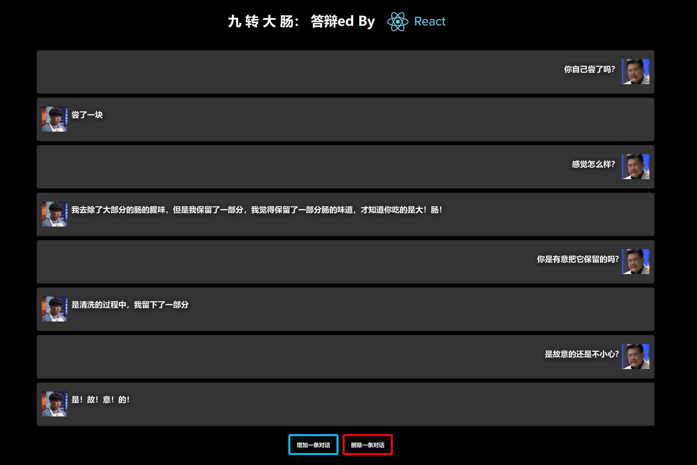

# 九 转 大 肠-React
#### 这是一个玩梗的项目，用于大家学习React
## 使用方法
1. 拉取项目
~~~shell
git clone https://github.com/Vincent-the-gamer/JiuZhuanDaChang-React.git
~~~

2. 运行项目
~~~shell
yarn run serve
npm run serve
~~~

## 项目预览
访问预览页面：
[https://vincent-the-gamer.github.io/JiuZhuanDaChang-React](https://vincent-the-gamer.github.io/JiuZhuanDaChang-React)

